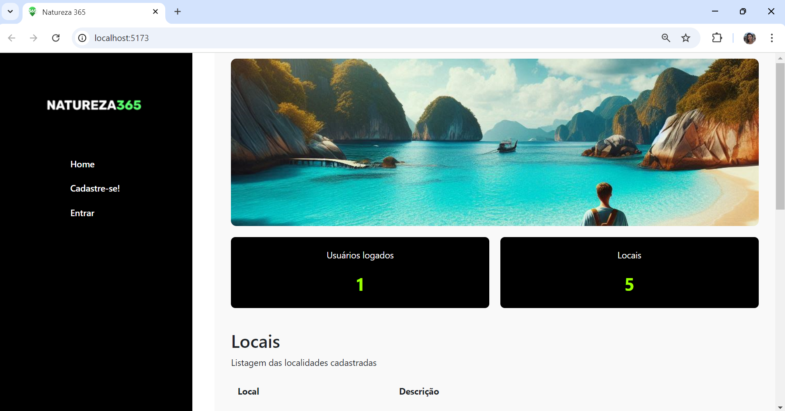

# Projeto final - Módulo 03 - FloripaMaisTec - FuturoDEV/Nature - Squad 3

## Descrição do Projeto 📌
Aplicação de Front-End que compõe o projeto final do módulo 3 do curso Analista de Desenvolvimento Web do Sesi/Senai.

# Natureza365 - Plataforma de Preservação da Natureza 🌳

## Apresentação 🌿
Bem-vindo ao **Natureza365**, que foi desenvolvida com o objetivo de incentivar a preservação ambiental por meio de uma plataforma colaborativa, onde os usuários podem cadastrar locais de preservação da natureza e explorar os já existentes. A aplicação facilita o compartilhamento de informações sobre áreas naturais, trilhas, parques ecológicos, reservas ambientais, praias e outros locais de interesse e permite que os usuários contribuam para a conscientização e preservação desses locais.


## Sumário

- [Problema que Resolve](#problema-que-resolve)
- [Funcionalidades](#funcionalidades)
- [Tecnologias Utilizadas](#tecnologias-utilizadas)
- [Instalação e Execução](#instalação-e-execução)
- [Usuários e locais](#usuários-e-locais)
- [Estrutura das Páginas](#estrutura-das-páginas)
- [Aprendizados](#aprendizados)
- [Possíveis Melhorias](#possíveis-melhorias)
- [Screenshots](#screenshots)
- [Histórico GITFLOW](#histórico-gitflow)


## Problema que Resolve
O Natureza 365 resolve o problema de gerenciamento e organização de informações sobre locais da natureza, permitindo que os usuários cadastrem, visualizem listas de locais cadastrados, editem e excluam dados de forma eficiente e centralizada.


## Tela Dashboard
Imagem da aplicação rodando em conjunto com o projeto do Back-End:
- <https://github.com/FuturoDEV-Nature/M3P-BackEnd-Squad3>




## Funcionalidades

- **Home**: Exibição do número de usuários logados, quantidade de locais cadastrados, lista com todos os locais cadastrados com opção de visualizar detalhes e sua localização.

- **Cadastro de Usuários**: Permite que novos usuários se cadastrem na plataforma. O cadastro inclui informações como nome, sexo, CPF (único para cada usuário), data de nascimento, e-mail, senha e endereço.

- **Login**: Sistema de autenticação para que os usuários acessem suas contas.

- **Cadastro de Áreas de Preservação**: Usuários cadastrados podem adicionar novos locais de preservação, incluindo nome, descrição, endereço e coordenadas geográficas.

- **Listagem de Locais**: Exibição dos locais cadastrados pelo usuário, com opção de visualizar detalhes, editar ou excluir os registros.

- **Dashboard**: Exibição do número de usuários logados e locais cadastrados, além de uma visão geral dos dados da plataforma.

- **Mapas e markers**: Exibição de um mapa na página home e na dashboard com todos os locais identificados com markers próprios que ao serem clicados exibem o nome e a descrição do local. Exibição também de um mapa único quando a página de um local específico é visualizado.

- **Responsividade**: Todas as páginas do sistema são responsivas e se adapatam aos diferentes tamanhos de tela.


## Tecnologias Utilizadas

A aplicação foi desenvolvida utilizando as seguintes tecnologias e bibliotecas:

- **React**: Biblioteca JavaScript para construção de interfaces de usuário.
- **React Router Dom**: Para roteamento entre as páginas da aplicação.
- **React Hook Form**: Para gerenciamento de formulários.
- **Leaflet** e **React Leaflet**: Para renderização de mapas e localização de locais cadastrados.
- **Bootstrap**: Framework CSS para estilização responsiva.
- **Vite**: Ferramenta de build e servidor de desenvolvimento.
- **ESLint**: Ferramenta para análise de código estático e garantia de boas práticas.


## Instalação e Execução

Para rodar o **Natureza365** em seu ambiente local, siga os passos abaixo:

### Pré-requisitos

- Node.js (versão 16 ou superior)
- NPM instalado em sua máquina

### Passo a Passo


1. Clone o repositório da API Rest de integração com o Back-End e siga as instruções do repositório para rodar a aplicação:
- <https://github.com/FuturoDEV-Nature/M3P-BackEnd-Squad3>

2. Clone este repositório:
   ```bash
   git clone https://github.com/FuturoDEV-Nature/M3P-FrontEnd-Squad3.git

3. Instale as dependências:
   ```bash
   npm install

4. Inicie o servidor de desenvolvimento:
   ```bash
   npm run dev 

5. Acesse a aplicação em **http://localhost:5173**


## Usuários e locais

Ao acessar a aplicação pela primeira vez o servidor vai iniciar com usuários e locais já salvos para facilicar a visualização da aplicação em funcionamento. Caso não deseje criar um novo usuário, os seguintes usuários e senhas podem ser utilizados para efetuar o login:

**email**: josue@gmail.com
**senha**: josue1234

**email**: rodrigo@gmail.com
**senha**: rodrigo1234

**email**: leiliane@gmail.com
**senha**: leiliane1234

**email**: anaisa@gmail.com
**senha**: anaisa1234

**email**: bruno@gmail.com
**senha**: bruno1234


## Estrutura das páginas

### Home
- Página inicial pública mostrando a quantidade de usuários logados e total de locais cadastrados.
- Opções de redirecionamento para cadastro e login.
- Lista todos os locais cadastrados.

### Login
- Página para autenticação dos usuários
- Opções de login e redirecionamento para cadastro.

### Cadastro
- Página para cadastro dos usuários
- Opções de retorno ao login e redirecionamento automático ao cadastrar com sucesso.

### Dashboard
- Exibe uma visão geral dos usuários logados e lista dos locais cadastrados.
- Inclui cards com contagens de usuários logados e locais cadastrados.
- Exibe mapa com markers de todos os locais cadastrados no sistema.
- Inclui link para detalhes dos locais cadastrados.
- Inclui link para os locais cadastrados pelo usuário logado, com possibilidades de edição e deleção.

### Cadastro da Área de Preservação
- Formulário para adicionar áreas de preservação
- Uso da API de CEP para preencher dados de endereço automaticamente.

### Edição de um local
- Formulário já preenchido com os dados do local com possibilidade alteração de informações.


## Aprendizados
A construção da aplicação colocou em prática e aprimorou os conhecimentos em programação como:

- **Versionamento de código e uso do Github**
- **Uso do Trello para organização de tarefas**
- **Utilização de Tags e Elementos semânticos de HTML**
- **Habilidade em CSS** como a utilização de seletores, estilos, layouts e flexbox
- **JavaScript**: Variáveis, Tipos de dados, Operadores, Manipulação do DOM, Estrutura de Controle de Fluxo, Funções, Eventos, JSON, LocalStorage, Interval, Timeout, Operadores Rest e Spread, Módulos, Arrow Functions, Funções de Arrays, Funções Assíncronas e Fetch.
- **React**: Renderização de componentes, Props, Proptypes, Hooks, Eventos, Renderização de listas, React Router, Formulários, Prop Drilling, Composition, Estilos (Material UI e Boostrap), Developer Tools.
- **Skills**: Organização, criação de documentação e apresentação de solução.


## Possíveis Melhorias
Trata-se de uma primeira versão do aplicativo e muitas melhorias ainda podem ser impletamentas como a criação de uma página para exibição dos dados do usuário, assim como a possibilidade de alterar os dados e também deletar o usuário caso ele deseje e adição de imagens dos locais cadastrados.

Poderia ser implementada também pequenas melhorias de convivência para o usuário como uma mensagem de bem-vindo e a identificação do usuário dentro da aplicação com seu nome e email.

A aplicação poderia ter também um sistema de busca para que o usuário possa selecionar alguma área do mapa onde teria mais interesse em conhecer locais de preservação.

Fiquem à vontade para sugerir ideias e nos ajudar a deixar o Natureza365 mais completo e funcional!

Desde já, agradecemos!


## Screenshots


## Histórico Gitflow


 
## 🖇️ Projeto orientado por:
Profº Bruno Costa


## ✒️ Projeto desenvolvido por:
- ### Rodrigo Ribeiro
- - [@RodRibDev](https://www.github.com/RodRibDev) 📫 rodrigo_r_ribeiro@estudante.sesisenai.org.br
- ### Josué Santos
- - [@josuesantos7](https://www.github.com/josuesantos7)  📫  josuesantossantosvf@gmail.com
- ### Leiliane Costa
- - [@leilianelcs](https://www.github.com/leilianelcs)  📫  leilianelcs@gmail.com